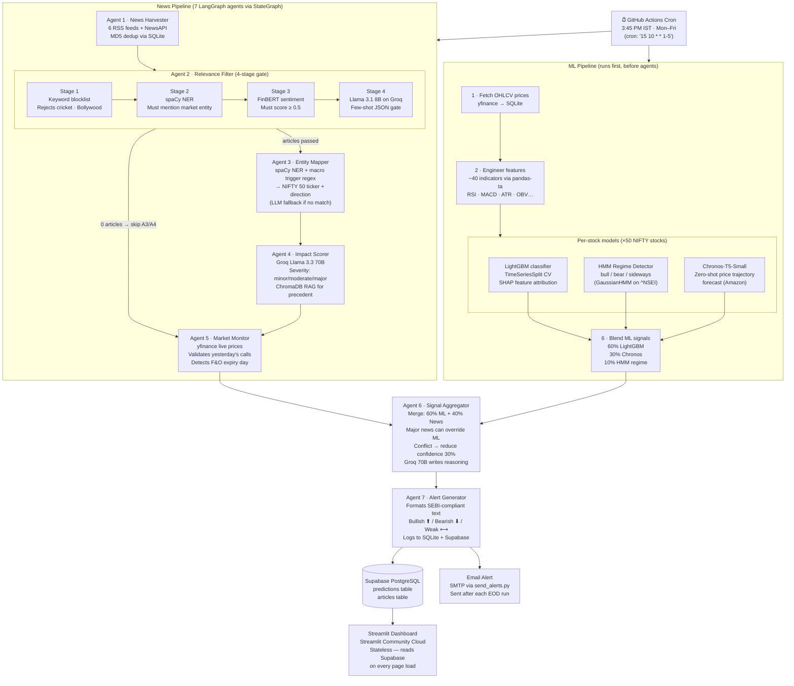
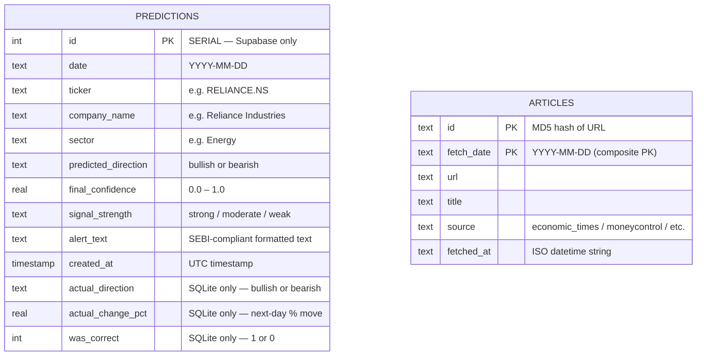

# MarketPulse AI — Interview Diagrams

Both diagrams are grounded entirely in the codebase.
Paste either block directly into any Mermaid renderer (mermaid.live, VS Code, Notion, etc.).

---

## Deliverable 1 — Architecture & Flow Diagram

---

## Deliverable 2 — Database Design

### What is actually in the codebase

**Honest assessment of the schema situation:**

There are **two storage layers** and they have a **schema mismatch**:

| Layer | Tables | Defined in |
|---|---|---|
| **Supabase** (production) | `predictions`, `articles` | `supabase_setup.sql` — formal DDL exists |
| **SQLite** (local dev) | `predictions` only | Created ad-hoc in `signal_aggregator.py` and `market_monitor.py` via `CREATE TABLE IF NOT EXISTS` |

The **SQLite `predictions` table has more columns than Supabase** — specifically `actual_direction`, `actual_change_pct`, and `was_correct` (written by `validate_previous_predictions()` in `market_monitor.py`). These columns do **not exist in `supabase_setup.sql`**, so accuracy tracking is SQLite-only and never reaches the cloud dashboard.

The diagram below shows the actual Supabase schema (from `supabase_setup.sql`) **plus** the extra columns that only live in SQLite, clearly labelled.

### Key design notes (grounded in code)

- **`predictions` has no FK to `articles`** — the pipeline stores signals and articles independently; there is no join between them in any query.
- **Composite PK on `articles(id, fetch_date)`** — same URL is allowed on different days (dedup is scoped to today only, per `init_db()` in `news_harvester.py`).
- **`actual_direction`, `actual_change_pct`, `was_correct` are Supabase-absent** — `market_monitor.py` writes these to SQLite via `UPDATE predictions SET actual_direction=? ...` and tries to sync to Supabase, but the Supabase table DDL in `supabase_setup.sql` doesn't have these columns. They would need to be `ALTER TABLE predictions ADD COLUMN` to exist in the cloud.
- **`company_name` and `sector` are in `supabase_setup.sql` but absent from the SQLite DDL** in `signal_aggregator.py` — they're only populated in the `save_predictions_to_db.py` Supabase payload.
- **No ChromaDB schema shown** — ChromaDB (used by Agent 4 for RAG) is a local vector store at `data/chroma_db/`. It has one collection: `news_impact_history`, with document = headline, metadata = `{ticker, predicted_direction, actual_outcome, confidence, date}`. It is never synced to Supabase.

---

*Diagrams generated 2026-07-16 from: `agents/graph.py`, `agents/state.py`, all 7 agent files, `ml/signal_combiner.py`, `ml/regime_detector.py`, `ml/chronos_forecaster.py`, `pipeline/eod_pipeline.py`, `.github/workflows/agent_pipeline.yml`, `supabase_setup.sql`, `save_predictions_to_db.py`.*
