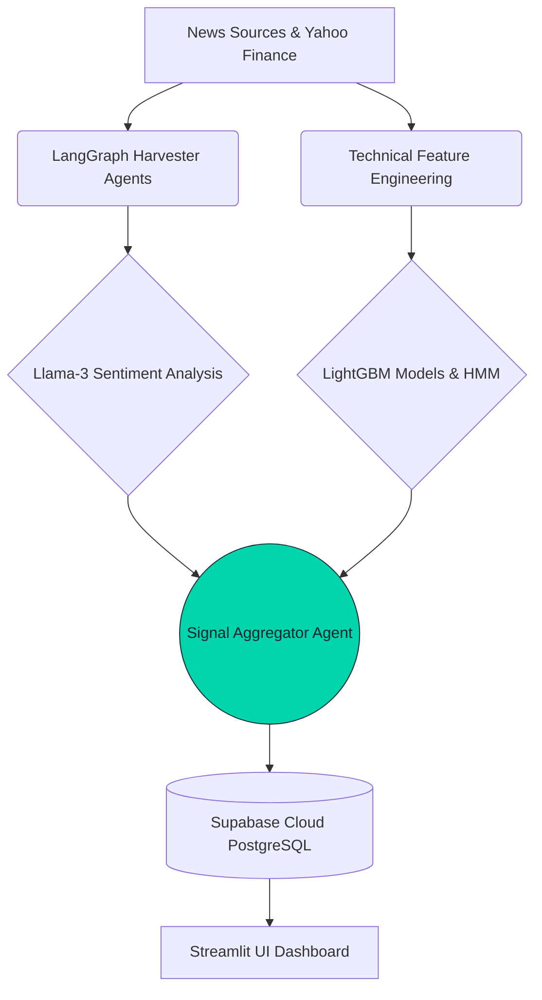

# MarketPulse AI 📈🤖

[](https://python.org)
[](https://marketpulseai-ldtbr3bebbybb8njzf6pmj.streamlit.app/)
[](https://supabase.com)
[](https://github.com/Divgagan/MarketPulse_AI/actions)
[](https://opensource.org/licenses/MIT)

> **An autonomous, multi-agent artificial intelligence system for NIFTY 50 stock market signal intelligence.** 

Built with **LangGraph**, **Llama-3 (Groq)**, **LightGBM**, and a cloud-native **Streamlit** dashboard, MarketPulse AI runs 100% autonomously in the cloud to predict stock market direction.

---

## 🚀 Live Dashboard
**View the live, automated dashboard here:** [MarketPulse AI Streamlit App](https://marketpulseai-ldtbr3bebbybb8njzf6pmj.streamlit.app/)

> ⚠️ **RESEARCH DISCLAIMER:** MarketPulse AI is a student research and educational project. It is NOT investment advice. Do not use signals for actual trading decisions. We are not SEBI-registered investment advisors.

---

## 🧠 How It Works

MarketPulse AI acts as a fully autonomous AI Hedge Fund Analyst. It combines two powerful pipelines into a single prediction:

1. **Fundamental Pipeline (7 LangGraph Agents)** — Wakes up daily, monitors financial news, filters out noise, maps events to NIFTY 50 stocks, and uses Llama-3 to extract bullish/bearish market sentiment.
2. **Technical Pipeline (Machine Learning)** — Uses 138 custom-trained LightGBM models + HMM (Hidden Markov Models) to detect market regimes and predict statistical price direction.

Every weekday at 3:45 PM IST, the **GitHub Actions** server automatically triggers the AI. The agents synthesize the news and the math, generate a final calibrated signal, and push the results to a **Supabase PostgreSQL** cloud database, which instantly updates the Streamlit dashboard.

---

## 🏗️ System Architecture



---

## 🛠️ Technology Stack

| Component | Technology |
|---|---|
| **Agent Orchestration** | LangGraph & LangChain |
| **Large Language Models** | Llama 3.3 70B & Llama 3.1 8B (via Groq) |
| **Machine Learning** | LightGBM, `hmmlearn`, `pandas-ta` |
| **Cloud Database** | Supabase (PostgreSQL) |
| **Automation / CI/CD** | GitHub Actions |
| **Frontend Dashboard** | Streamlit Community Cloud |
| **Data Providers** | `yfinance`, NewsAPI, RSS Feeds |

---

## 💻 Local Development Setup

If you want to run or modify MarketPulse AI locally:

### 1. Clone the Repository
```bash
git clone https://github.com/Divgagan/MarketPulse_AI.git
cd MarketPulse_AI
```

### 2. Install Dependencies
Ensure you have Python 3.12+ installed.
```bash
pip install -r requirements_pipeline.txt
pip install -r requirements.txt
python -m spacy download en_core_web_sm
```

### 3. Set Up Environment Variables
Create a `.env` file in the root directory and add your keys:
```ini
GROQ_API_KEY="gsk_..."
SUPABASE_URL="https://your-url.supabase.co"
SUPABASE_KEY="sb_publishable_..."
```

### 4. Run the Pipeline
To manually trigger the AI to read the news and generate predictions for the day:
```bash
python -m pipeline.eod_pipeline
```

### 5. Launch the Dashboard
```bash
streamlit run dashboard/app.py
```

---

## ⚙️ Cloud Automation

This project is deployed using a 100% serverless, free-tier cloud architecture.
- **`.github/workflows/agent_pipeline.yml`**: A cron job that triggers at 10:15 AM UTC (3:45 PM IST) Monday-Friday.
- The pipeline securely reads the API keys from GitHub Actions Secrets.
- It writes the daily predictions to Supabase.
- Streamlit Community Cloud acts as a stateless frontend, reading the Supabase tables in real-time.

---

## 📜 License
This project is licensed under the MIT License - see the [LICENSE](LICENSE) file for details.

*Built by Divgagan as a learning project in advanced agentic workflows and quantitative finance.*
